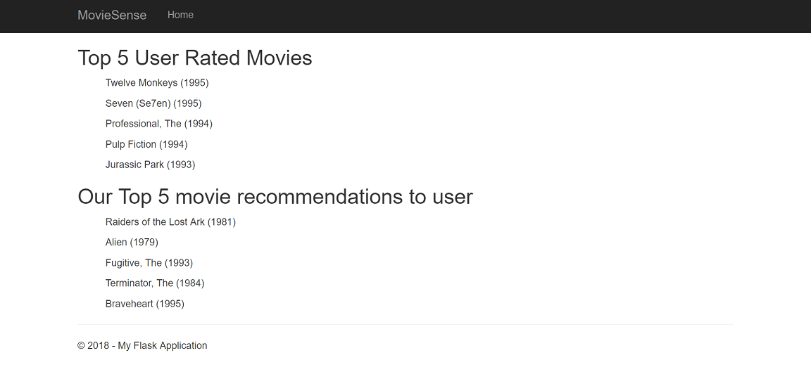

# Movie-recommendation-app
using python flask webserver

This project is a demonstration of creating a Flask Web Server Application that renders a 
movie recommendation model created with lightfm package.  In this project popular 
movielens 100k dataset which has 950 users movies ratings on 1640 movies on the scale of 1 to 5.  

The algorithm used hybrid latent representation recommender model which converts the 
sparsed matrices into condensed form by generating emmbeding based on features, and these 
features are summed together to arrive at representations for users and items.

This project demonstrates all the variations of model parameters such as WARP, KOS-WARP, BPR and logistic.

This is the screenshot showing options to enter the user id and choosing one of the model parameter.

This screenshot shows the Top 5 user rated movies and Our model's Top 5 movie recommendations.

